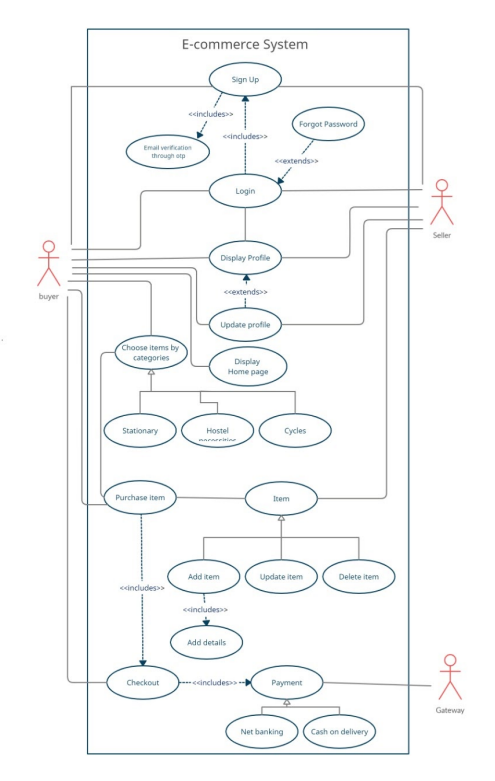
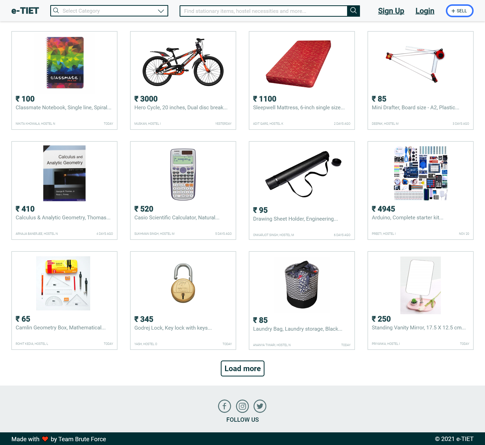

# Title: e-TIET

## 1. Methodology

## 2. Description

e-TIET is an e-commerce platform that provides an ease in establishment of connection between buyers and sellers i.e. students within Thapar. It aims to eliminate the chaos that students confront when purchasing basic requirements inside the campus.

### Tech Stack Used

- MongoDB - Database used
- Express - Server/routing API for web app
- Node - Backend JS runtime
- Mailtrap - Test mail server
- Cloudinary - Image management tool
- Stripe - Payment API

### API Reference

Postman Documentation: [https://documenter.getpostman.com/view/11541273/UVXhrHaP](https://documenter.getpostman.com/view/11541273/UVXhrHaP)

### How to build and run this project

### Setting up the project

- Clone this repository: `https://github.com/mac2503/e-tiet2.git`
- Create .env file in the root directory of the project
- Install node.js and npm on your local machine
- Install the dependencies: `npm install`

### Running the project

- Run the dev script in the terminal: `npm run dev`
  - Server starts running at http://localhost:5000
  - Server automatically restarts when any of the files are changed

## 3. Input/Output

## 4. Screenshot of the Interface

