### e-TIET

e-TIET is an e-commerce platform that provides an ease in establishment of connection between buyers and sellers i.e. students within Thapar. 
It aims to eliminate the chaos that students confront when purchasing basic requirements inside the campus.

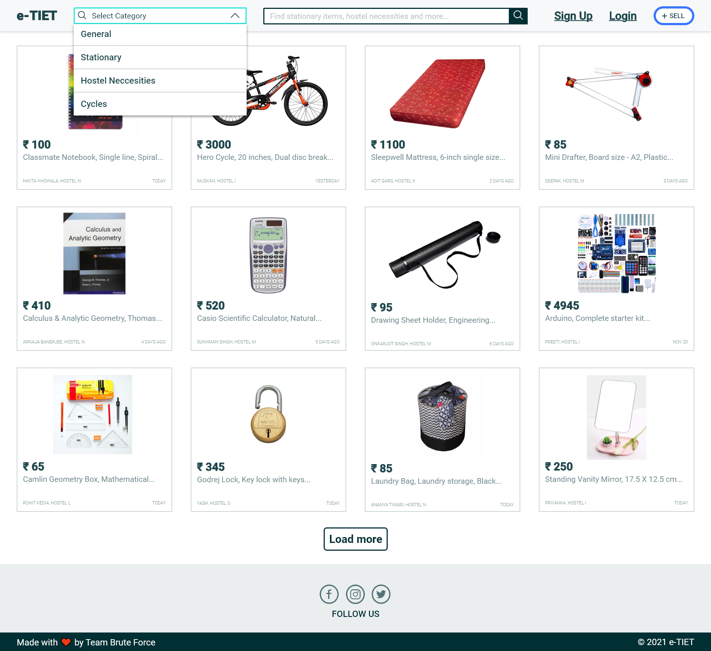

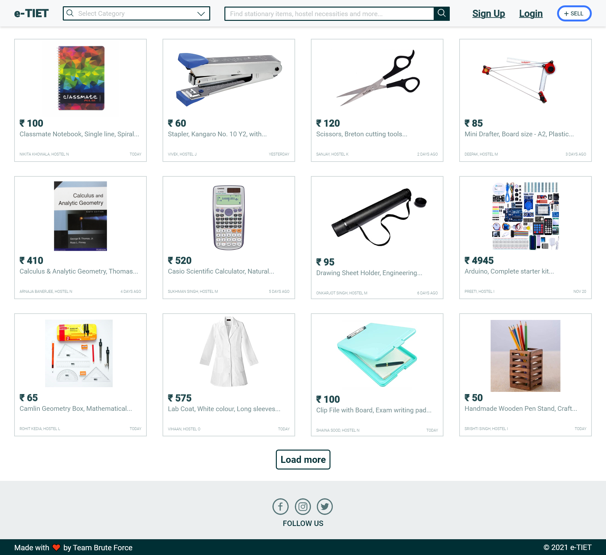

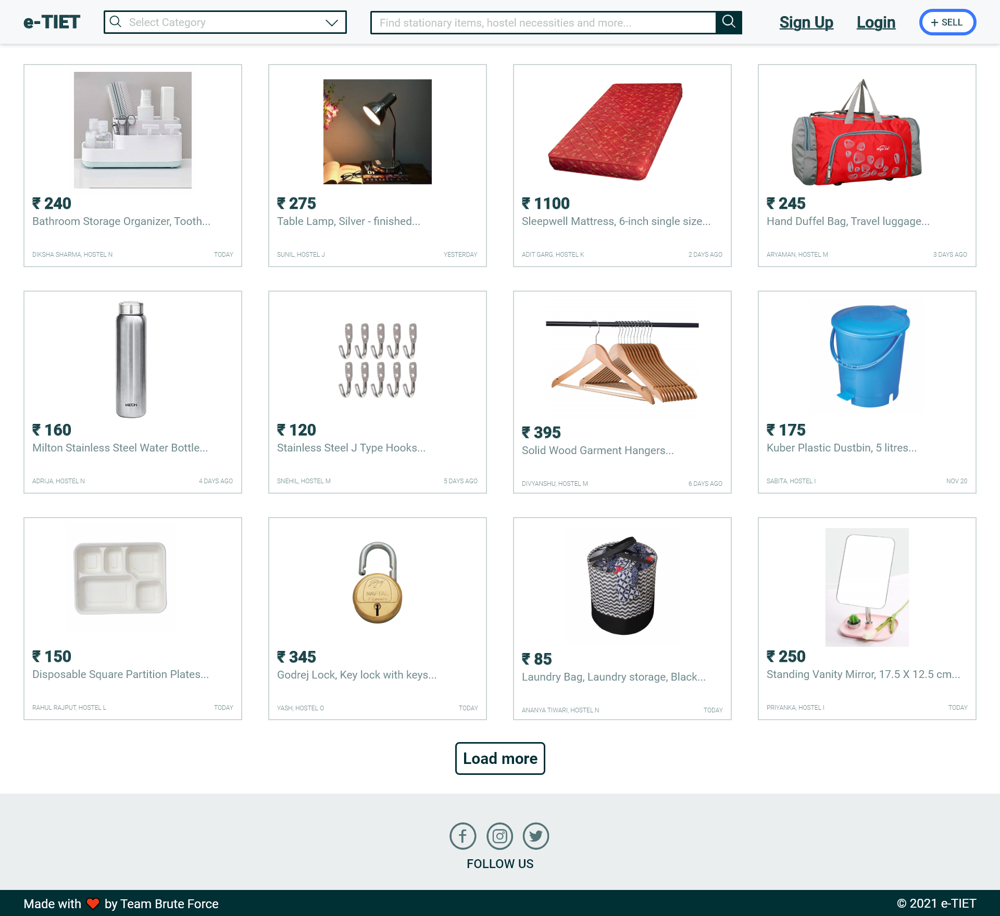

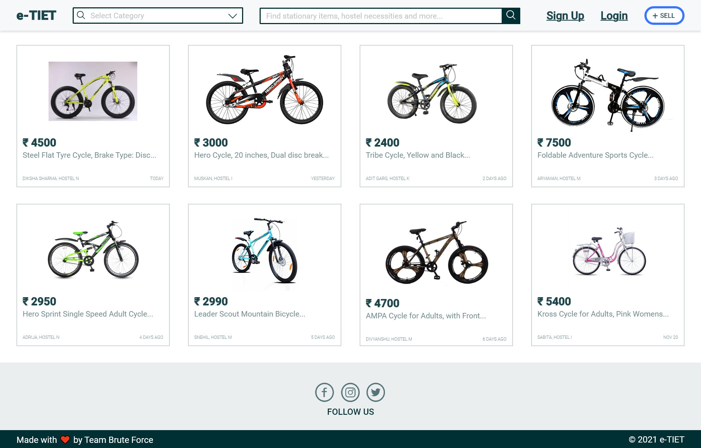

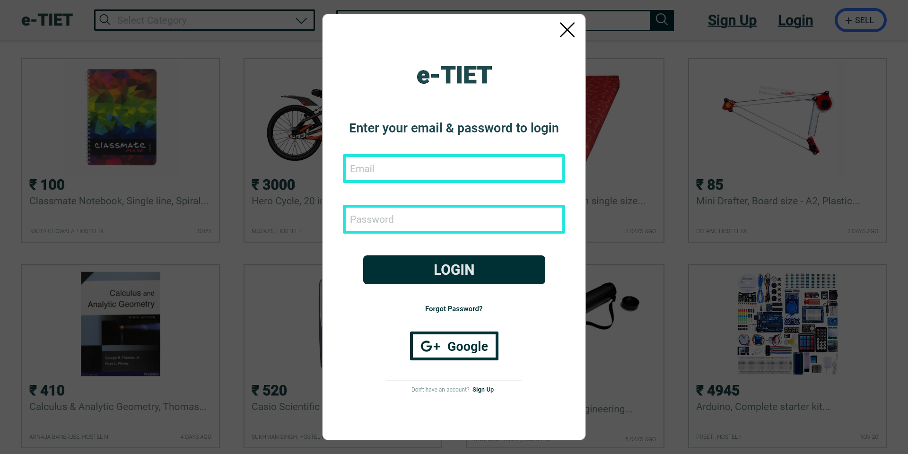

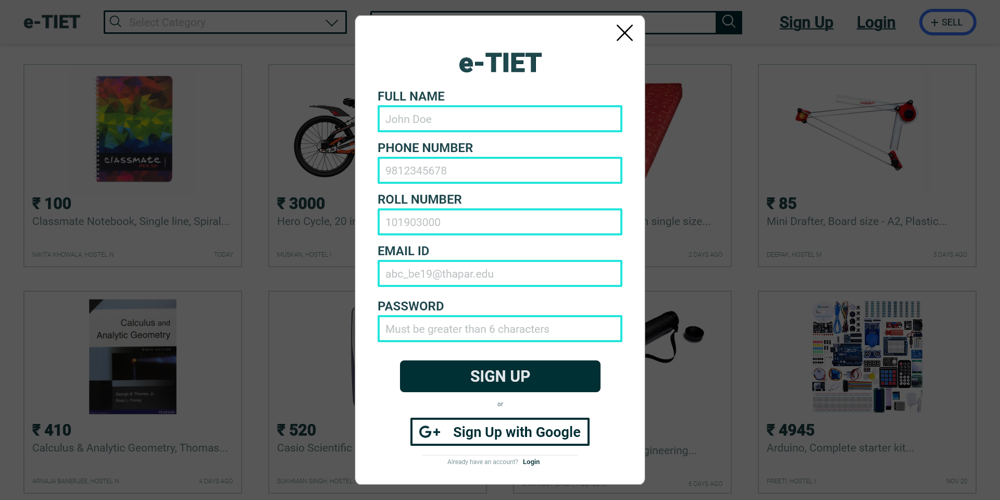

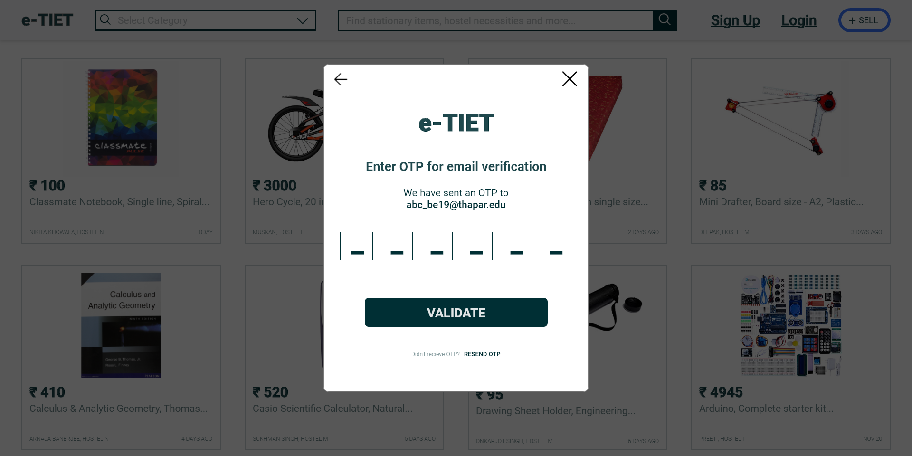

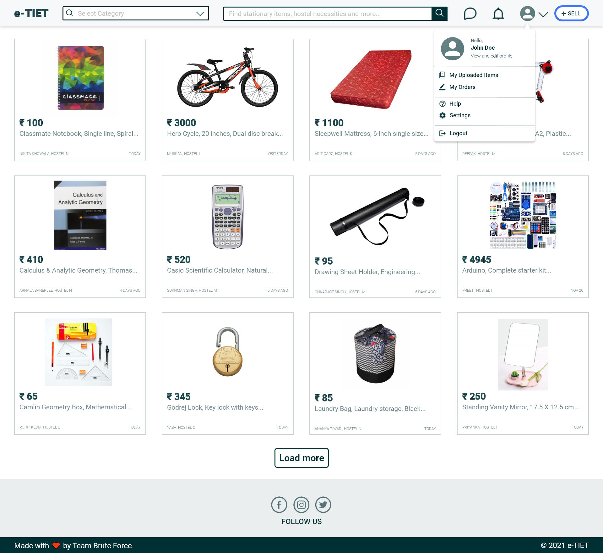

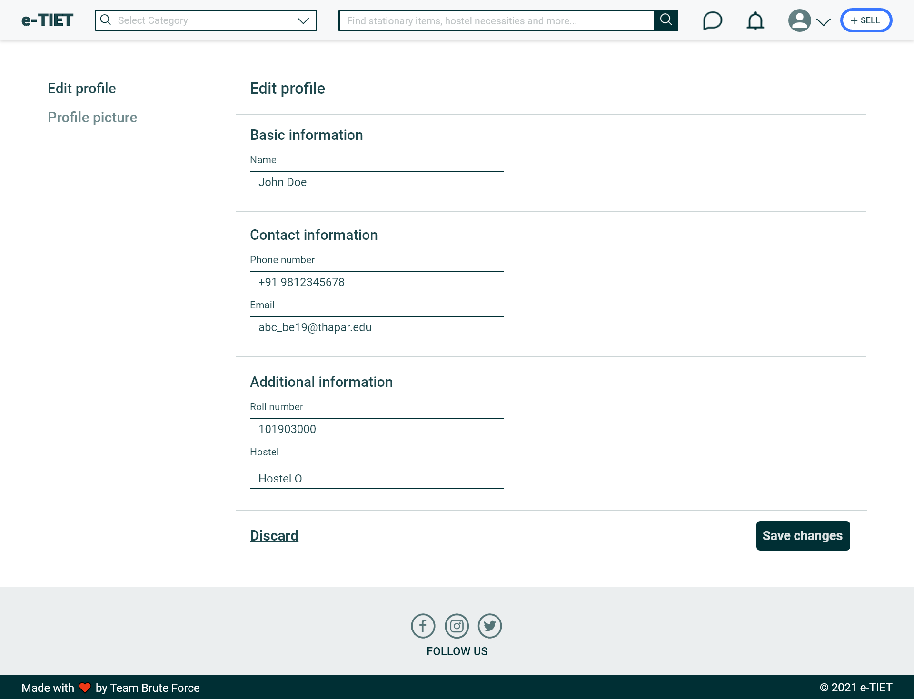

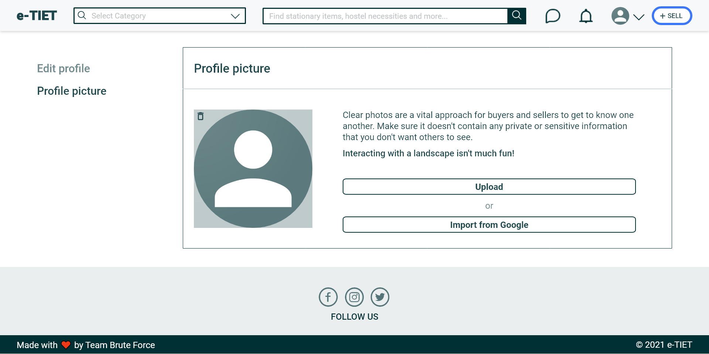

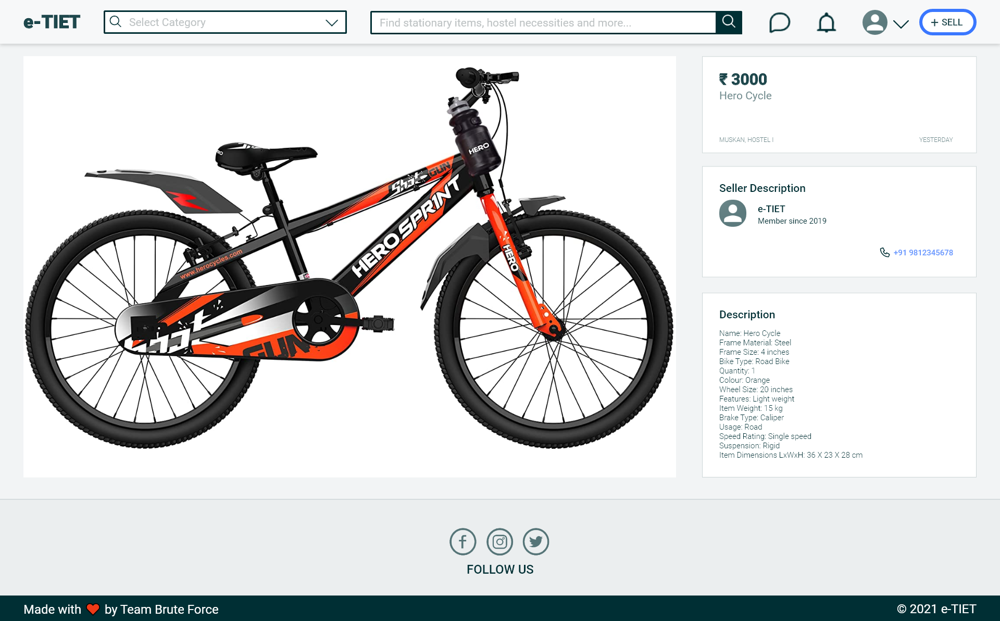

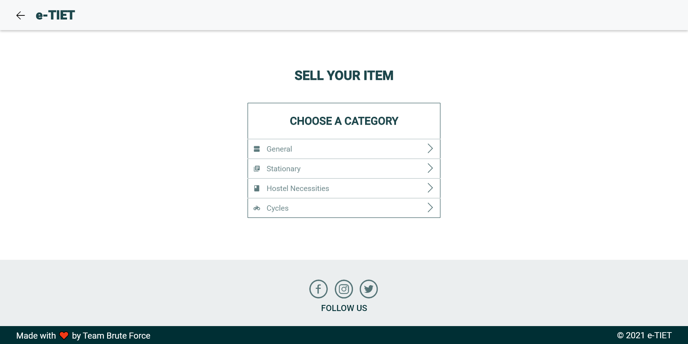

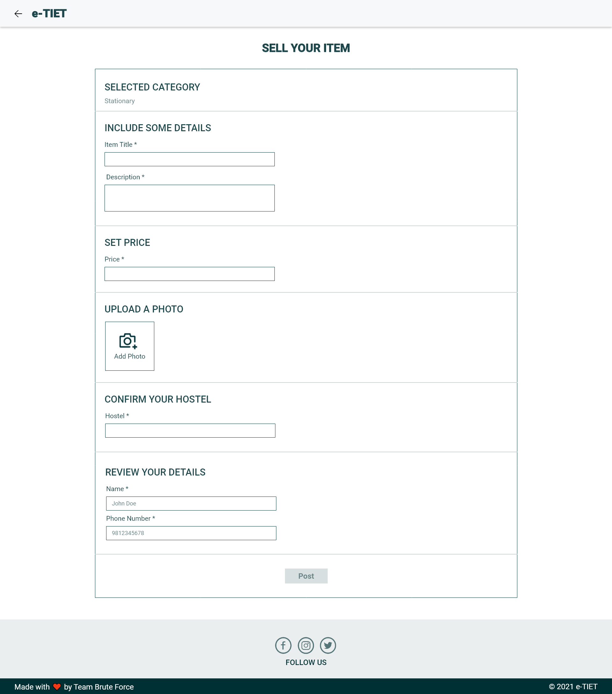
